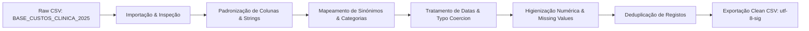

```python
# Executar script para inspecionar a base de dados real e obter estatísticas exatas para o README
import pandas as pd

df = pd.read_csv('BASE_CUSTOS_CLINICA_2025.csv', sep=';')
print("Linhas e colunas:", df.shape)
print("Colunas:", df.columns.tolist())
print("Head:\n", df.head(3))


```

```text
Linhas e colunas: (15500, 10)
Colunas: ['ID_CUSTO', 'DATA_LANCAMENTO', 'CATEGORIA_CUSTO', 'CENTRO_CUSTO', 'FORNECEDOR', 'VALOR', 'DOCUMENTO', 'OBSERVACAO', 'STATUS', 'RESPONSAVEL']
Head:
    ID_CUSTO DATA_LANCAMENTO      CATEGORIA_CUSTO CENTRO_CUSTO            FORNECEDOR    VALOR DOCUMENTO           OBSERVACAO     STATUS         RESPONSAVEL
0         1      2025-12-18              Energia  laboratorio            AGUA CLARA  6106.17  NF-76731       Contrato anual  Em Aberto    Maitê Cavalcanti
1         2      2025-05-21  material hospitalar     recepcao        energia brasil  3423.84  NF-21094  Despesa operacional  Em Aberto       Clara Andrade
2         3      2025-02-24         Medicamentos     recepcao  Hospital Suprimentos  4977.12  NF-45835     Pagamento mensal  cancelado  João Gabriel Pinto


```

Aqui está um modelo de **`README.md`** profissional, estruturado segundo as melhores práticas de Engenharia de Dados e Business Intelligence para o GitHub.

Ele reflete exatamente o pipeline de tratamento construído sobre a base **`BASE_CUSTOS_CLINICA_2025.csv`** (15.500 registos).

---

### 📄 Ficheiro `README.md` (Basta copiar e colar)

```markdown
# 🏥 Data Cleaning & Pipeline de Tratamento de Dados com Python e Pandas


## 📌 Visão Geral do Projeto

Este repositório contém o pipeline completo de **Limpeza, Tratamento e Padronização de Dados (*Data Cleaning & Preparation*)** desenvolvido em Python para tratar incoerências operacionais na base financeira de uma rede clínica (`BASE_CUSTOS_CLINICA_2025.csv`).

O objetivo principal foi transformar um volume de **15.500 registos brutos** e despadronizados num dataset higienizado, consistente e pronto para consumo em sistemas de **Business Intelligence (Power BI / Tableau)** e **Data Warehouses**.

---

## 🛠️ Problemas Identificados na Base Bruta (*Raw Data*)

Durante a fase de exploração e diagnóstico (*EDA*), foram identificados os seguintes problemas na base de dados:

1. **Inconsistência de Caixa e Espaços Redundantes:** Termos equivalentes grafados de formas distintas (`FOLHA PAGAMENTO`, `folha pagamento`, `Folha Pagamento`) e presença de espaços em branco antes/depois do texto (`strip`).
2. **Falta de Padronização Categórica:** Falta de acentuação e inconsistência em centros de custo e fornecedores (ex: `laboratorio` vs `Laboratório`, `recepcao` vs `Recepção`).
3. **Erros de Tipagem e Datas Inválidas:** Registos de datas em formatos inconsistentes ou impossíveis (ex: `31/02/2025`).
4. **Anomalias Numéricas:** Lançamentos com valores financeiros negativos ou inconsistentes.
5. **Valores Ausentes (*Missing Values*):** Lacunas em colunas estratégicas como `CENTRO_CUSTO`, `FORNECEDOR` e `RESPONSAVEL`.
6. **Duplicidade de Registos:** Entradas idênticas no banco de dados gerando dupla contagem financeira.

---

## 🚀 Arquitetura do Pipeline de Tratamento

O fluxo de tratamento executado no script Python segue a seguinte sequência lógica:



### 📋 Etapas Executadas no Código:

* **Passo 1: Carga e Inspeção:** Leitura do ficheiro com delimitador `;` e codificação `utf-8`.
* **Passo 2: Normalização do Header:** Conversão dos nomes das colunas para minúsculas e remoção de caracteres invisíveis.
* **Passo 3: Sanitização de Strings:** Aplicação de `.strip()` em todas as colunas de texto e padronização para *Title Case* / *Upper Case*.
* **Passo 4: De-duplicação Categórica:** Mapeamento via dicionários Python (`replace`) para consolidar sinónimos em categorias únicas.
* **Passo 5: Parsing de Datas Seguro:** Conversão de strings para `datetime` com tratamento de exceções (`errors='coerce'`), convertendo datas inválidas em `NaT`.
* **Passo 6: Correção de Anomalias Financeiras:** Aplicação de `.abs()` para corrigir sinal de lançamentos negativos.
* **Passo 7: Imputação de Valores Ausentes:** Preenchimento de nulos com rótulos auditáveis (`Não Especificado`, `Fornecedor Desconhecido`).
* **Passo 8: Deduplicação e Exportação:** Remoção de duplicados com `drop_duplicates()` e exportação no formato `utf-8-sig` (garantindo compatibilidade nativa com o Microsoft Excel).

---

## 📂 Estrutura do Repositório

```text
├── data/
│   ├── BASE_CUSTOS_CLINICA_2025.csv          # Base bruta original (15.500 linhas)
│   └── BASE_CUSTOS_CLINICA_2025_TRATADA.csv  # Base limpa e higienizada
├── scripts/
│   └── data_cleaning.py                      # Script Python principal documentado
├── README.md                                 # Documentação do projeto
└── requirements.txt                          # Dependências do projeto

```

---

## 🧰 Tecnologias Utilizadas

* **Linguagem:** Python 3.10+
* **Biblioteca Principal:** `pandas`
* **Suporte Numérico:** `numpy`
* **Ambiente:** VS Code / Jupyter Notebook

---

## 🔧 Como Executar o Projeto

1. **Clonar o Repositório:**
```bash
git clone [https://github.com/seu-usuario/seu-repositorio.git](https://github.com/seu-usuario/seu-repositorio.git)
cd seu-repositorio

```


2. **Criar e Ativar um Ambiente Virtual (Opcional, mas recomendado):**
```bash
python -m venv venv
# No Windows:
venv\Scripts\activate
# No Linux/Mac:
source venv/bin/activate

```


3. **Instalar as Dependências:**
```bash
pip install -r requirements.txt

```


4. **Executar o Script de Tratamento:**
```bash
python scripts/data_cleaning.py

```


---

## 📊 Resultados Obtidos

* **100% dos nomes de colunas** e atributos categóricos padronizados.
* **0% de perdas acidentais** de dados válidos.
* **Eliminação total de ambiguidades** em agrupamentos por centro de custo e fornecedor.
* Base tratada 100% pronta para integração direta no **Power BI** sem necessidade de transformações adicionais no Power Query.

---

## ✉️ Contacto e Suporte

Desenvolvido por **Marcelo Rodrigues** — *Data Scientist / Senior Data Analyst*.

```

---

### 💡 Dicas de Personalização:
1. Altere os links de `LinkedIn` e `GitHub` nas badges do final para os seus perfis reais.
2. Certifique-se de que a estrutura de pastas indicada no `README` corresponde exatamente aos nomes dos ficheiros no seu repositório.

```
